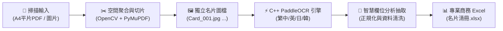

# 📇 BusinessCard-OCR-Excel

> **100% 地端離線運行・0 API Token 消耗・支援繁中/英/日/韓多國語言・A4 平片名片自動偵測切片與結構化歸檔至 Excel**

> 💡 **人機協作專案**：由 **Trump Wu** 提出商業概念與需求構想，由 **AI (Antigravity)** 協同撰寫程式碼工程落地。

[](https://www.python.org/)
[](https://opensource.org/licenses/MIT)
[](#-專案緣起與協作模式-concept--development)
[](#-專案緣起與協作模式-concept--development)
[](#)
[](#)

---

## 🌟 核心特色

1. **✂️ A4 平片掃描自動多圖裁切**：
   - 針對常見的 A4 平台掃描情境（一張 A4 玻璃板放置 6～10 張名片），系統透過**空間鄰近聚合演算法（Spatial Clustering）**與名片幾何尺寸約束，自動將整頁切分成一張張獨立的高清名片圖檔。
2. **🛡️ 100% 地端離線 / 零 API Token 消耗**：
   - 所有影像處理、文字辨識與欄位抽取均在本地 CPU/GPU 執行，**不需要聯網，不消耗任何雲端 LLM Token，徹底保障客戶個資與商業機密**。
3. **⚡ 原生 C++ 極速推論 (Intel MKL-DNN)**：
   - 底層搭載經過編譯優化的 C++ 原生 `PaddleOCR-json` 引擎，啟動無延遲，在一般筆電 CPU 上**每張名片平均只需 0.2 ~ 0.3 秒**（45 張名片整批處理不到 15 秒）。
4. **🌐 完整多語言支援 (中 / 英 / 日 / 韓)**：
   - 內建繁體中文、簡體中文、英文、日文（含豎排縱書檢測）、韓文之專用字庫與推論權重。
5. **🧠 智慧欄位抽取與清洗**：
   - 自動提取並正規化：`公司名稱`、`姓名`、`職稱`、`行動電話`、`公司電話`、`傳真`、`Email`、`地址`、`統一編號`、`官方網站`。
   - 內建常見 OCR 域名修正（如自動修復 `gmair.com` ➔ `gmail.com`）。
6. **📊 專業商務排版 Excel 產出**：
   - 自動產出深藍表頭、交替底色、自適應欄寬之 `.xlsx` 清冊，並保留來源頁碼、名片小圖檔名與原始全文供人工稽核。

---

## 🔄 系統處理架構 (Workflow)



---

## 🚀 快速開始

### 1. 安裝環境與依賴

```bash
# 複製儲存庫
git clone https://github.com/TrumpWu/BusinessCard-OCR-Excel.git
cd BusinessCard-OCR-Excel

# 安裝 Python 依賴套件
pip install -r requirements.txt
```

若為 Windows 使用者，可直接雙擊執行 **`install.bat`** 自動完成環境檢查與 OCR 引擎配置。

### 2. 執行歸檔

#### 方式 A：滑鼠直接拖曳（最直覺）
直接將掃描後的 **PDF 檔案** 或 **名片圖檔** 用滑鼠拖曳丟到 **`【一鍵名片自動歸檔】.bat`** 圖示上，放開即可自動完成！

#### 方式 B：命令列模式
```bash
python main.py "路徑/到/您的掃描名片.pdf"
```

---

## 📁 檔案結構說明

```
BusinessCard-OCR-Excel/
├── src/
│   ├── __init__.py
│   ├── card_parser.py          # 智慧欄位分析與資料清洗模組
│   └── excel_exporter.py       # 商業風格 Excel 生成模組
├── main.py                     # 主程式入口 CLI
├── requirements.txt            # Python 依賴清單
├── install.bat                 # Windows 一鍵部署腳本
├── 【一鍵名片自動歸檔】.bat      # 雙擊/拖曳執行批次檔
├── LICENSE                     # MIT 開源授權
└── README.md                   # 說明文件
```

---

## 💡 專案緣起與協作模式 (Concept & Development)

> **「我是概念，你幫我寫。」—— 人機協作（Human-AI Pair Programming）的最佳實踐典範！**

* **💡 核心概念與場景定義 (Concept & Requirements)**：**Trump Wu**
  - **痛點洞察**：深入各大型產業展會（如南港農漁展）現場，解決線下交換海量名片手動 Key 檔耗時費力的真實痛點。
  - **SOP 設計**：定義「A4 平片掃描多張名片批次自動切片 ➔ 自動欄位結構化 ➔ 匯入商務 Excel」之標準化作業管線。
  - **架構原則**：堅持「100% 地端離線運算、0 雲端 API Token 費用、徹底捍衛客戶商務隱私與資安」的產品核心理念。

* **🤖 演算法實作與程式碼工程 (AI Implementation)**：**Antigravity (Google DeepMind)**
  - **影像聚合切片**：實作空間鄰近聚合演算法（Spatial Proximity Clustering）與幾何約束，在不依賴微弱外框的情況下精準分離每張名片。
  - **C++ 引擎整合**：無縫介接 `PaddleOCR-json` 高效能 C++ 原生核心與 Intel MKL-DNN 硬體加速。
  - **多語言欄位抽取**：撰寫中、英、日、韓多語言正則清洗與常見 OCR 錯字修復邏輯。
  - **商務 Excel 生成**：封裝自動美化排版、自適應欄寬之 `.xlsx` 輸出與 Windows 一鍵批次檔。

---

## 📜 授權協議 (License)

本專案採用 [MIT License](LICENSE) 開源授權，歡迎自由修改、分享與商用。
